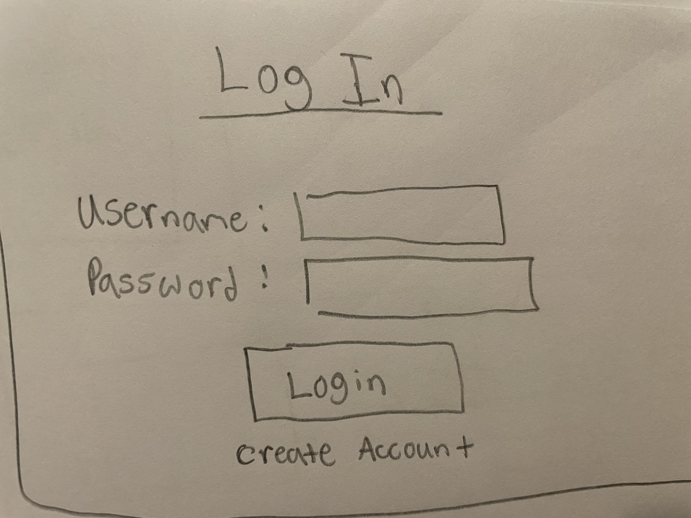
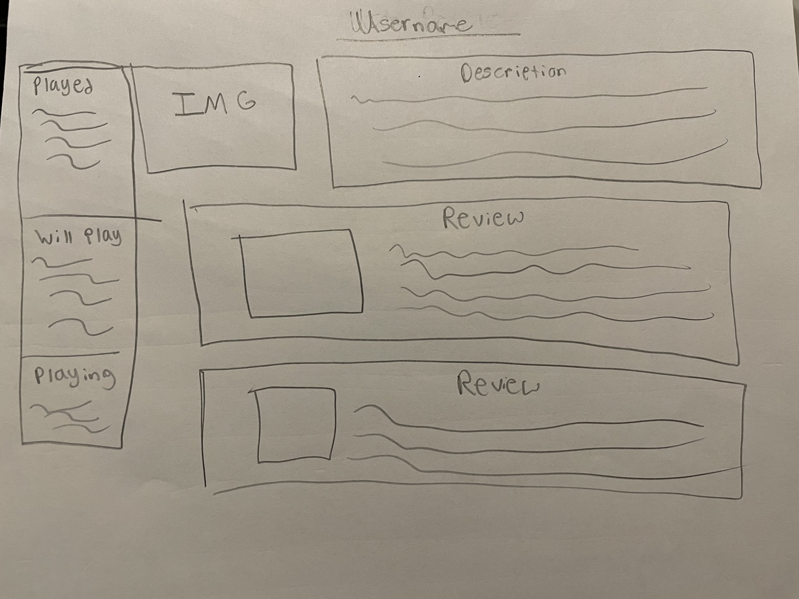
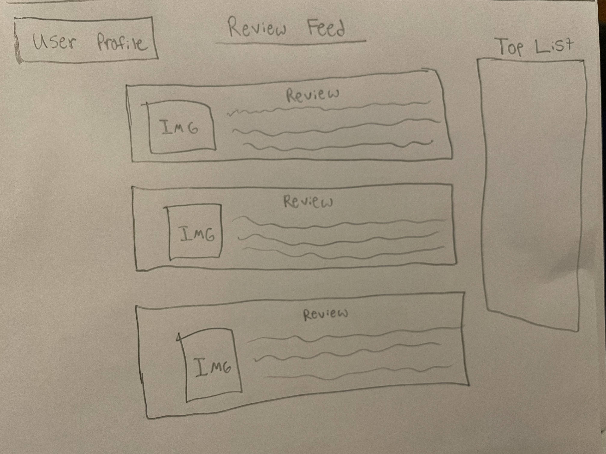
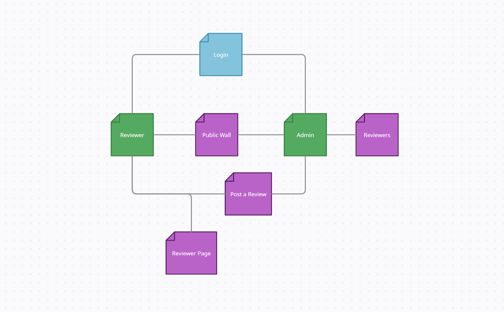
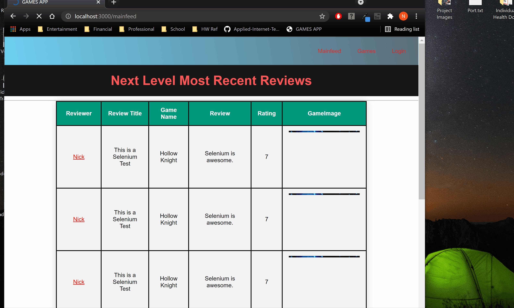

# Game Review Sharing Application

## Overview

This project is a video game review application. A user can create a profile and create a list of games they’d like to play or have played. Users can also review games they have played, which they can post on their “wall” in the form of a paragraph and a score from 1-10. There is a public feed of all reviews & a private feed specific to each user’s profile. There are also special admin accounts that can delete user reviews, delete users, and add to the list of reviewable games on the site. 

## Data Model

The application stores 2 types of Users: Admin and User

* Users have a profile page containing: 
    * Their "wall" - an aggregate of their reviews
    * Their "game list" containing:  
        * Favorite Games
        * Their Profile Avatar
    * User Information
        * Username
        * A description on their review style
* Admin Profile:
    * Same functionality as user
    * Denoted by having an authority of admin
    * Added functionality to delete other users and add to the list of reviewable games


An Example User:

```javascript
{
  //this is an example of the user schema
    username: String, // Username
    password: String, //A hashed password
    willPlay: String, 
    havePlayed: String,
    playing: String, 
    reviews: Object,
    authority: String,
    email: String,
    password: String,
    avatar: String,
    description: String,
//other properties can be added later
}

```

An example of a review:

```javascript
//An example of a review 
{
    reviewer: String,
    gameName: String,
    text: String,
    rating: Number,
    title: String,
    platform: String,
    gameImage: String,
}

```

## [Link to Commented First Draft Schema](db.js)

## Wireframes
A wireframe for the login page is shown below:

A wireframe for the profile page is shown below:

A wireframe for the Main feed page is shown below:


## Site Map



## User Stories or Use Cases

1. As a game enthusiast I can keep share my opinion & keep track of my backlog, so that I can play more games and remember what I enjoyed.
2. As a casual gamer, I can see the opinions of others & choose a new game to play, so that I can efficiently make an entertainment decisions

## Research Topics

* Integrate Boostrap(1 pts)
    * Minimally integrate Bootstrap for certain pages
* Automated functional testing for all routes (5 pts)
    * Likely using selenium
* Multer Libray Usage for Photo Upload (2 pts)

8/8 Points

## Selenium Testing Gif & File Links
User Functionality Testing:

Admin Functionality Testing:

Invalid Access Testing:

Review Creation Testing:


## [Link to Initial Main Project File](app.js)

## Annotations / References Used
[Selenium Web Driver Tutorial](https://www.browserstack.com/guide/automation-using-selenium-javascript)
<br>
[Mocha](https://mochajs.org/)
<br>
[Multer](https://www.npmjs.com/package/multer)
